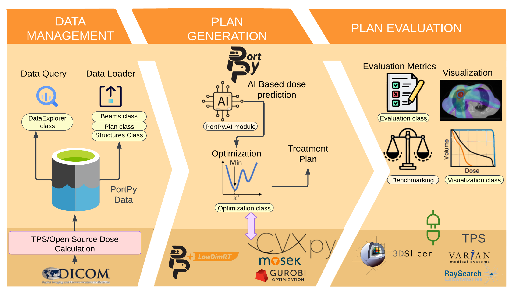

<p align="center">
  
</p>


[](https://pepy.tech/project/portpy?&left_text=totalusers)

# What is PortPy?

PortPy, short for **P**lanning and **O**ptimization for **R**adiation **T**herapy, 
is an initiative aimed at creating an open-source Python library for 
cancer radiotherapy treatment planning optimization. 
This project encompasses planning methodologies for Intensity Modulated Radiation Therapy (IMRT), 
Volumetric Modulated Arc Therapy (VMAT), and other emerging modalities. 
PortPy offers clinical-grade benchmark datasets and coding resources to promote *benchmarking*, 
*reproducibility*, and *community development*.


**Note:** If you are new to the field, we suggest reviewing relevant literature review papers
([Zarepisheh et al. 2021](https://pubsonline.informs.org/doi/abs/10.1287/inte.2021.1095), 
[Breedveld et al. 2019](https://www.sciencedirect.com/science/article/abs/pii/S0377221718307148), 
[Ehrgott et al. 2010](https://link.springer.com/article/10.1007/s10479-009-0659-4)) and watching YouTube videos 
([Edelman competition](https://www.youtube.com/watch?v=895M6j5KjPs&t=1025s), 
[Varian IMRT](https://www.youtube.com/watch?v=eZS6DVGBx0k), 
[Elekta VMAT](https://www.youtube.com/watch?v=AE1SxvnFT3s)). In the near future, 
we plan to launch an educational YouTube channel to assist researchers new to this field. 
  

**Contents**
- [Quick start and examples](#QuickStart)
- [Benchmark data, benchmark algorithms, and PortPy toolkit](#benchmark)
- [What can you do with PortPy?](#WhatDo)
- [How to contribute?](#limitations)
- [Data](#Data)
- [Installation](#Installation)
- [Team](#Team)

# Quick start and examples <a name="QuickStart"></a>
The easiest way to start is through the PorPy following examples. 

| Example File                          	                                                                                                        | Description                                                                                                                                                           	|
|------------------------------------------------------------------------------------------------------------------------------------------------|-----------------------------------------------------------------------------------------------------------------------------------------------------------------------	|
| [1_basic_tutorial.ipynb](https://github.com/PortPy-Project/PortPy/blob/master/examples/1_basic_tutorial.ipynb)                	                | Demonstrates the main functionalities of PortPy (e.g., Access data, create an IMRT plan, visualize)                                                                   	|
| [VMAT_scp_tutorial.ipynb](https://github.com/PortPy-Project/PortPy/blob/master/examples/vmat_scp_tutorial.ipynb)               	               | Creates a VMAT plan using sequential convex programming                                                                                                               	|
| [VMAT_scp_dose_prediction.ipynb](https://github.com/PortPy-Project/PortPy/blob/master/examples/vmat_scp_dose_prediction.ipynb)                 | Predicts 3D dose distribution using deep learning and converts it into a deliverable VMAT plan                                                                        	|
| [3d_slicer_integration.ipynb](https://github.com/PortPy-Project/PortPy/blob/master/examples/3d_slicer_integration.ipynb)           	           | Creates an IMRT plan and visualizes it in 3D-Slicer                                                                                                                   	|
| [IMRT_TPS_import.ipynb](https://github.com/PortPy-Project/PortPy/blob/master/examples/IMRT_TPS_import.ipynb)                	                  | 1. Outputs IMRT plan in DICOM RT format and imports it into TPS. <br>2. Outputs IMRT plan optimal fluence in an Eclipse-compatable format and imports it into Eclipse 	|
| [VMAT_TPS_import.ipynb](https://github.com/PortPy-Project/PortPy/blob/master/examples/VMAT_TPS_import.ipynb)                 	                 | Outputs VMAT plan in DICOM RT format and imports it into TPS                                                                                                          	|
| [IMRT_dose_prediction.ipynb](https://github.com/PortPy-Project/PortPy/blob/master/examples/IMRT_dose_prediction.ipynb)            	            | Predicts 3D dose distribution using deep learning and converts it into a deliverable IMRT plan                                                                        	|
| [VMAT_global_optimal.ipynb](https://github.com/PortPy-Project/PortPy/blob/master/examples/vmat_global_optimal.ipynb)           	               | Finds a globally optimal VMAT plan                                                                                                                                    	|
| [beam_orientation_global_optimal.ipynb](https://github.com/PortPy-Project/PortPy/blob/master/examples/beam_orientation_global_optimal.ipynb) 	 | Finds globally optimal beam angles for IMRT                                                                                                                           	|
| [dvh_constraint_global_optimal.ipynb](https://github.com/PortPy-Project/PortPy/blob/master/examples/dvh_constraint_global_optimal.ipynb)  	    | Finds a globally optimal plan meeting Dose Volume Histogram (DVH) constraints                                                                                         	|
| [structure_operations.ipynb](https://github.com/PortPy-Project/PortPy/blob/master/examples/structure_operations.ipynb)            	            | Creates new structures by expanding/shrinking the existing ones or using boolean operations                                                                           	|
| [inf_matrix_down_sampling.pynb](https://github.com/PortPy-Project/PortPy/blob/master/examples/inf_matrix_down_sampling.ipynb)         	        | Down-samples beamlets and/or voxels for computational efficiency                                                                                                      	|
| [inf_matrix_sparsification.ipynb](https://github.com/PortPy-Project/PortPy/blob/master/examples/inf_matrix_sparsification.ipynb)       	                      | Sparsifies (i.e., truncates) the influence matrix for computational efficiency                                                                                        	|


# Benchmark data, benchmark algorithms, and PortPy toolkit <a name="benchmark"></a>

<p align="center">
  
<p>

The figure above illustrates the inspiration behind developing PortPy, drawing from successful 
open-source practices in the AI and computer science communities. Tools like PyTorch and TensorFlow, 
along with benchmark datasets such as ImageNet and algorithms like AlexNet, have revolutionized AI 
and data science. Our goal is to replicate this success by providing researchers with a benchmark 
dataset (currently featuring 50 curated lung patients), benchmark algorithms for finding globally 
optimal plans using Mixed Integer Programming, and the PortPy toolkit for 
creating, evaluating, and visualizing treatment plans.


# What can you do with PortPy? <a name="WhatDo"></a>

<p align="center">

<p>

PortPy facilitates the **design**, **testing**, and **clinical validation** of new treatment planning algorithms. 
This includes both cutting-edge AI-based models and traditional optimization techniques. 
The above figure illustrates the PortPy design and its three main
modules: “Data Management”, “Plan Generation”, and “Plan
Evaluation”,  which are discussed below. We recommend reviewing our Jupyter Notebooks 
[examples](#QuickStart) for a more comprehensive understanding of these modules. 

1. **Data Management**
     * This module provides access to the curated benchmark PortPy dataset, allowing 
   researchers to test their algorithms on a standardized dataset (see [basic_tutorial.ipynb](https://github.com/PortPy-Project/PortPy/blob/master/examples/1_basic_tutorial.ipynb) notebook)
     * The available data includes: 
        1) CT images and contours 
        2) all necessary data for optimization extracted from Eclipse using its API (version 16.1) 
        3) expert-selected beams for each patient 
        4) an IMRT plan for each patient, 
generated using our in-house automated planning system, 
ECHO ([YouTube Video](https://youtu.be/895M6j5KjPs), [Paper](https://aapm.onlinelibrary.wiley.com/doi/epdf/10.1002/mp.13572)).
More information about data can be found in [Data](#Data) section.
     * In the current version, you can only work with the benchmark dataset provided in this PortPy repo and 
   cannot use your own dataset for now. We will address this problem in the near future

2. **Plan Generation**
     * This module facilitates the generation of treatment plans using either classical optimization methods or 
emerging AI-based techniques 
     * For optimization tasks, PortPy has been integrated with [CVXPy](https://www.cvxpy.org/), a widely-used open-source package. 
CVXPy enables the high-level formulation of optimization problems and offers out-of-the-box access to a range
of free (e.g., [SCIP](https://www.scipopt.org/), [SCIPY](https://docs.scipy.org/doc/scipy/reference/optimize.html)) and commercial (e.g., [MOSEK](https://www.mosek.com/), [CPLEX](https://www.ibm.com/products/ilog-cplex-optimization-studio/cplex-optimizer), [GUROBI](https://www.gurobi.com/)) optimization engines (available for free for research
purposes) (see [basic_tutorial.ipynb](https://github.com/PortPy-Project/PortPy/blob/master/examples/1_basic_tutorial.ipynb) notebook)
     * PortPy.AI module is equipped with essential functionalities for AI-based planning. These include data access, 
data pre-processing, model training and testing, and patient-specific 3D dose prediction 
(see [IMRT_dose_prediction.ipynb](https://github.com/PortPy-Project/PortPy/blob/master/examples/IMRT_dose_prediction.ipynb) notebook)

3. **Plan Visualization and Evaluation**
     * Basic built-in visualization tools (e.g., DVH, dose distribution) are integrated into PortPy 
     * Enhanced visualizations are available through the integration with the popular open-source [3DSlicer](https://www.slicer.org/) package (see [3d_slicer_integration.ipynb](https://github.com/PortPy-Project/PortPy/blob/master/examples/3d_slicer_integration.ipynb) notebook)
     * Plans can be quantitatively evaluated using well-established clinical protocols (e.g., Lung 2Gyx30, see  [basic_tutorial.ipynb](https://github.com/PortPy-Project/PortPy/blob/master/examples/1_basic_tutorial.ipynb))
     * Plans can be imported into any TPS for final clinical evaluations  (see [IMRT_TPS_import.ipynb](https://github.com/PortPy-Project/PortPy/blob/master/examples/IMRT_TPS_import.ipynb))  


# How to contribute? <a name="HowContribute"></a>
<p align="center">

<p>

As illustrated in the above figure, PortPy organization includes "PortPy", which is the current repository, 
and PortPy extensions, which are the repositories developed using the PortPy as a platform. 
To maintain the lightweight nature and user-friendliness of PortPy modules, our aim is to include only fundamental 
functionalities, along with benchmark data and algorithms in the PortPy repo, and establish separate repositories 
for other projects, similar to what we've done for projects like [LowDimRT](https://github.com/PortPy-Project/LowDimRT)
and [ECHO VMAT](https://github.com/PortPy-Project/ECHO-VMAT).

If you're interested in contributing to existing PortPy modules or wish to create a new module, 
we encourage you to contact us first. This will help ensure that our objectives and priorities are aligned. 
If you use PortPy to build your own package, you're welcome to host your package within the
[PortPy-Project orgainization](https://github.com/PortPy-Project). 
Alternatively, you can host your package on your own GitHub page. In this case, 
please inform us so that we can fork it and feature it under the PortPy-Project organization. 
For those keen on creating a logo for their repository, we offer the option to customize our [pre-designed logo](https://www.canva.com/design/DAFxivHC0Js/YqZREdr26pmEsIgCeuU-iA/view?utm_content=DAFxivHC0Js&utm_campaign=designshare&utm_medium=link&utm_source=publishsharelink&mode=preview).


# Data <a name="Data"></a>
<p align="center">

<p>
PortPy equips researchers with a robust benchmark patient dataset, sourced from the FDA-approved Eclipse commercial treatment planning system through its API. This dataset embodies all necessary elements for optimizing various machine configurations such as beam angles, aperture shapes, and leaf movements. It includes

1. **Dose Influence Matrix (AKA dose deposition matrix, dij matrix):** The dose contribution of each beamlet to each voxel,
2. **Beamlets/Voxels Details:** Detailed information about the position and size of beamlets/voxels,
3. **Expert-Selected Benchmark Beams:** An expert clinical physicist has carefully selected benchmark beams, providing reference beams for comparison and benchmarking,
4. **Benchmark IMRT Plan:** A benchmark IMRT plan generated using our in-house automated treatment planning system called ECHO ([YouTube Video](https://youtu.be/895M6j5KjPs), [Paper](https://aapm.onlinelibrary.wiley.com/doi/epdf/10.1002/mp.13572)). This plan serves as a benchmark for evaluating new treatment planning algorithms.
5. **Benchmark Clinical Criteria:** A set of clinically relevant mean/max/DVH criteria for plan evaluation. 
Currently, this set encompasses only the Lung 2Gy×30 protocol but will be expanded in the future to more protocols as well as TCP/NTCP evaluation functions.  

To access these resources, users are advised to download the latest version of the dataset, 
which can be found [here](https://drive.google.com/drive/folders/1nA1oHEhlmh2Hk8an9e0Oi0ye6LRPREit?usp=sharing). 
Subsequently, create a directory titled './data' in the current project directory and transfer the downloaded 
file into it. For example, ./data/Lung_Phantom_Patient_1. 
We have adopted the widely-used JSON and HDF5 formats for data storage.
[HDFViwer](https://www.hdfgroup.org/downloads/hdfview/) can be utilized to view the contents of the HDF5 files.  


**Note:** Initially, we will utilize a lung dataset from [TCIA](https://wiki.cancerimagingarchive.net/display/Public/NSCLC-Radiomics). The original DICOM CT images and structure sets are not included in the PortPy dataset and need to be directly downloaded from the TCIA. Users can fetch the **TCIA collection ID** and the **TCIA subject ID** for each PortPy patient using the *get_tcia_metadata()* method in PortPy and subsequently download the data from TCIA (see [IMRT_TPS_import](https://github.com/PortPy-Project/PortPy/blob/master/examples/IMRT_TPS_import.ipynb))


# Installation <a name="Installation"></a>

1. Install using pip:
   
    * Run the command '**pip install portpy**'

2. Install using conda:

    * Run the command '**conda install -c conda-forge portpy**'

3. Install from source:
   
    * Clone this repository using '**git clone https://github.com/PortPy-Project/PortPy.git**'
    * Navigate to the repository with '**cd portpy**'

    * Install the dependencies within a Python virtual environment or Anaconda environment. To set up in a Python virtual environment, install all the dependencies specified in requirements.txt as follows:
        * Create the virtual environment with '**python3 -m venv venv**'
        * Activate the environment with '**source venv/bin/activate**'
        * Install the requirements using '**(venv) pip install -r requirements.txt**'


# Team <a name="Team"></a>
PortPy is a community project initiated at [Memorial Sloan Kettering Cancer Center](https://www.mskcc.org/). It is currently developed and maintained by:

| Name                                                                         | Expertise                                        | Institution |
|------------------------------------------------------------------------------|--------------------------------------------------|-------------|
| [Masoud Zarepisheh](https://masoudzp.github.io/)                             | Treatment Planning and Optimization              | MSK         |
| [Saad Nadeem](https://nadeemlab.org/)                                        | Computer Vision and AI in Medical Imaging        | MSK         |
| [Gourav Jhanwar](https://github.com/gourav3017)                              | Algorithm Design and Development                 | MSK         |
| [Mojtaba Tefagh](https://github.com/mtefagh)                                 | Mathematical Modeling and Reinforcement Learning | SUT         |
| [Vicki Taasti](https://scholar.google.com/citations?user=PEPyvewAAAAJ&hl=en) | Physics and Planning of Proton Therapy           | MAASTRO     |
| [Seppo Tuomaala](https://www.linkedin.com/in/seppo-tuomaala-5b57913/)        | Eclispe API Scripting                            | VARIAN      |

# License <a name="License"></a>
PortPy code is distributed under **Apache 2.0 with Commons Clause** license, and is available for non-commercial academic purposes.

# Reference <a name="Reference"></a>
If you find our work useful in your research or if you use parts of this code please cite our [AAPM'23 abstract](https://aapm.confex.com/aapm/2023am/meetingapp.cgi/Paper/4208) :
```
@article{jhanwar2023portpy,
  title={Portpy: An Open-Source Python Package for Planning and Optimization in Radiation Therapy Including Benchmark Data and Algorithms},
  author={Jhanwar, Gourav and Tefagh, Mojtaba and Taasti, Vicki T and Alam, Sadegh R and Tuomaala, Seppo and Nadeem, Saad and Zarepisheh, Masoud},
  journal={AAPM 65th Annual Meeting & Exhibition},
  year={2023}
}
```


> Written with [StackEdit](https://stackedit.io/).