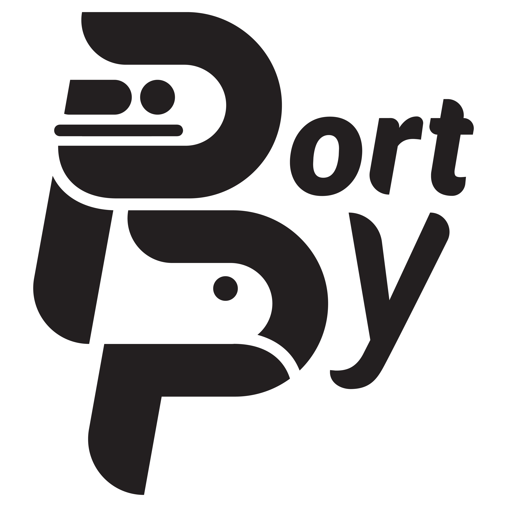
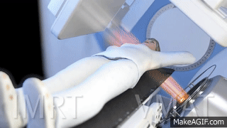
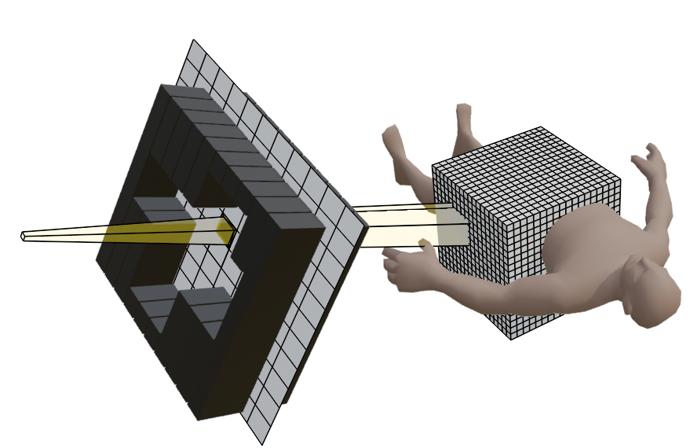
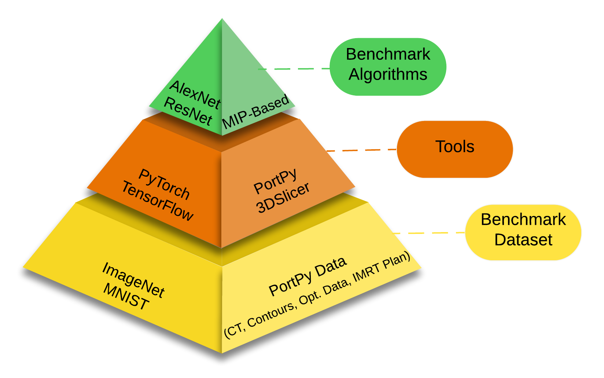
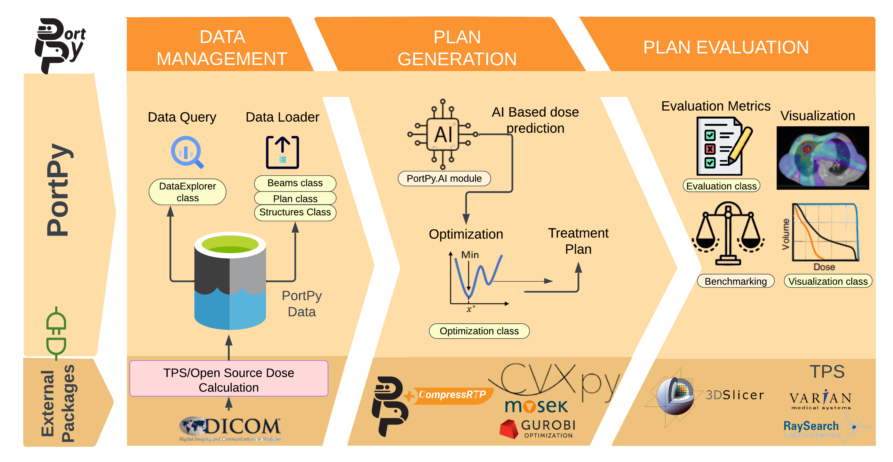
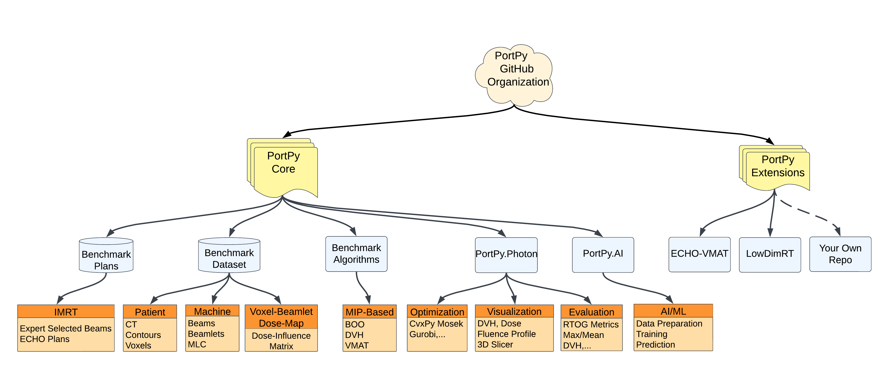
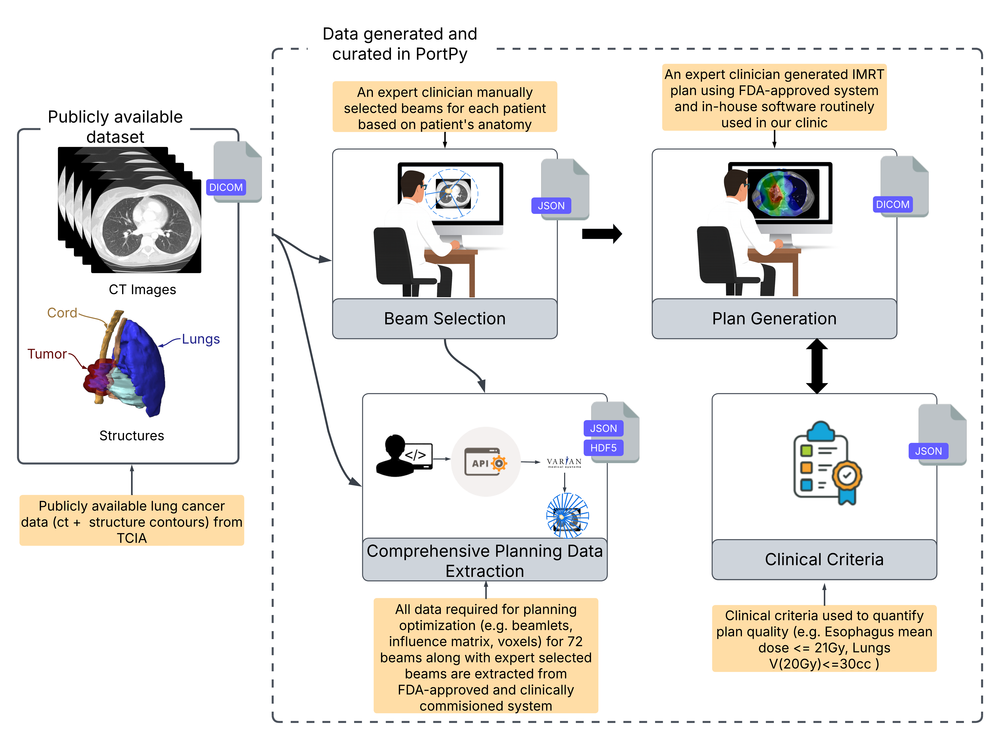

<p align="center">
  
</p>

<h2 align="center">
  <a href="https://portpy-project.github.io/portpy.github.io/">Documentation Website </a> | 
  <a href="#What">What is PortPy? </a> | 
    <a href="#RadOpt101">Radiotherapy Optimization 101 </a>

</h2>


[](https://pepy.tech/project/portpy?&left_text=totalusers)
[](https://pepy.tech/project/portpy)

**Note**: If you have any questions about PortPy, please create an [Issue](https://github.com/PortPy-Project/PortPy/issues) on Github. If you are unable to do so for any reason, you may contact Gourav Jhanwar (jhanwarg@mskcc.org)

# What is PortPy? <a name="What"></a>



**PortPy**, short for **P**lanning and **O**ptimization for **R**adiation **T**herapy, is an initiative aimed at creating an open-source Python library for cancer radiotherapy treatment planning optimization. Radiotherapy is a key treatment for over half of all cancer patients, either alone or alongside surgery, chemotherapy, and immunotherapy. It works by directing high-energy radiation beams at tumors to kill cancerous cells. Given that each patient has a unique anatomy, it is essential to customize the radiation beams' shape, angle, and intensity. The goal is to maximize damage to the tumor while minimizing exposure to healthy surrounding tissues. This process involves solving complex, large-scale mathematical optimization problems tailored to each individual patient. PortPy aims to accelerate research in this interdisciplinary field by offering tools, benchmark algorithms, and datasets.

**Contents**
- [Radiotherapy Optimization 101](#RadOpt101)
- [Quick start and examples](#QuickStart)
- [Benchmark data, benchmark algorithms, and PortPy toolkit](#benchmark)
- [High-Level Description of PortPy](#high-level)
- [How to contribute?](#HowContribute)
- [Data](#Data)
- [Installation](#Installation)
- [Team](#Team)


# Radiotherapy Optimization 101 <a name="RadOpt101"></a>


  
The key variables in treatment planning optimization are the parameters of the **radiation beams** (e.g., beams' shape, angle, and intensity). However, the quality of a treatment is primarily measured by the **radiation dose** delivered to the patient’s body. We can connect the beam parameters to the radiation dose using a straightforward linear relationship. First, we divide the patient’s body into small three-dimensional units called **voxels** and each radiation beam into small two-dimensional sections called **beamlets**. By calculating how much radiation each beamlet (j) delivers to each voxel (i), and representing this with a value **aij**, we create what is known as the **dose deposition matrix (A)**. This matrix links the intensities of the beamlets (x) to the total radiation dose delivered (d) using the equation: **d=Ax**. A general radiotherapy optimization problem can be formulated as:

Minimize f(Ax,x)
subject to g(Ax,x)<=0, x>=0

where f and g are functions that evaluate the quality of radiation dose (Ax) and the beamlet intensities (x). These optimization problems are typically **large**, **non-convex**, and involve **multiple conflicting criteria** (i.e., tumor irradiation vs healthy tissues’ sparing). They must be solved quickly for each patient, often within minutes, seconds, or even milliseconds, depending on whether the planning is done offline, online, or in real-time.

**Note:** If you are new to the field, we suggest reviewing relevant literature review papers
([Zarepisheh et al. 2021](https://pubsonline.informs.org/doi/abs/10.1287/inte.2021.1095), 
[Breedveld et al. 2019](https://www.sciencedirect.com/science/article/abs/pii/S0377221718307148), 
[Ehrgott et al. 2010](https://link.springer.com/article/10.1007/s10479-009-0659-4)) and watching YouTube videos 
([Edelman competition](https://www.youtube.com/watch?v=895M6j5KjPs&t=1025s), 
[Varian IMRT](https://www.youtube.com/watch?v=eZS6DVGBx0k), 
[Elekta VMAT](https://www.youtube.com/watch?v=AE1SxvnFT3s)). In the near future, 
we plan to launch an educational YouTube channel to assist researchers new to this field. **Meanwhile, you can support this effort by starring this GitHub page, which will help us secure funding for further development.**


# Quick start and examples <a name="QuickStart"></a>
The easiest way to start is through the PorPy following Jupiter Notebook examples. 

| Example File                          	                                                                                                                          | Description                                                                                                                                                           	                                                                          |
|------------------------------------------------------------------------------------------------------------------------------------------------------------------|--------------------------------------------------------------------------------------------------------------------------------------------------------------------------------------------------------------------------------------------------|
| [1_basic_tutorial.ipynb](https://github.com/PortPy-Project/PortPy/blob/master/examples/1_basic_tutorial.ipynb)                	                                  | Demonstrates the main functionalities of PortPy (e.g., Access data, create an IMRT plan, visualize)                                                                   	                                                                          |
| [eclipse_photon_dose_calculation.ipynb](https://github.com/PortPy-Project/PortPy/blob/master/examples/eclipse_photon_dose_calculation.ipynb)                	 | Demonstrates the capability of running dose calculation for patients outside PortPy dataset using Varian's photon dose calculation module and perform optimization in PortPy                                                                   	 |
| [vmat_scp_tutorial.ipynb](https://github.com/PortPy-Project/PortPy/blob/master/examples/vmat_scp_tutorial.ipynb)               	                                 | Creates a VMAT plan using sequential convex programming                                                                                                               	                                                                          |
| [vmat_scp_dose_prediction.ipynb](https://github.com/PortPy-Project/PortPy/blob/master/examples/vmat_scp_dose_prediction.ipynb)                                   | Predicts 3D dose distribution using deep learning and converts it into a deliverable VMAT plan                                                                        	                                                                          |
| [3d_slicer_integration.ipynb](https://github.com/PortPy-Project/PortPy/blob/master/examples/3d_slicer_integration.ipynb)           	                             | Creates an IMRT plan and visualizes it in 3D-Slicer                                                                                                                   	                                                                          |
| [imrt_tps_import.ipynb](https://github.com/PortPy-Project/PortPy/blob/master/examples/imrt_tps_import.ipynb)                	                                    | 1. Outputs IMRT plan in DICOM RT format and imports it into TPS. <br>2. Outputs IMRT plan optimal fluence in an Eclipse-compatable format and imports it into Eclipse 	                                                                          |
| [vmat_tps_import.ipynb](https://github.com/PortPy-Project/PortPy/blob/master/examples/vmat_tps_import.ipynb)                 	                                   | Outputs VMAT plan in DICOM RT format and imports it into TPS                                                                                                          	                                                                          |
| [imrt_dose_prediction.ipynb](https://github.com/PortPy-Project/PortPy/blob/master/examples/imrt_dose_prediction.ipynb)            	                              | Predicts 3D dose distribution using deep learning and converts it into a deliverable IMRT plan                                                                        	                                                                          |
| [vmat_global_optimal.ipynb](https://github.com/PortPy-Project/PortPy/blob/master/examples/vmat_global_optimal.ipynb)           	                                 | Finds a globally optimal VMAT plan                                                                                                                                    	                                                                          |
| [beam_orientation_global_optimal.ipynb](https://github.com/PortPy-Project/PortPy/blob/master/examples/beam_orientation_global_optimal.ipynb) 	                   | Finds globally optimal beam angles for IMRT                                                                                                                           	                                                                          |
| [dvh_constraint_global_optimal.ipynb](https://github.com/PortPy-Project/PortPy/blob/master/examples/dvh_constraint_global_optimal.ipynb)  	                      | Finds a globally optimal plan meeting Dose Volume Histogram (DVH) constraints                                                                                         	                                                                          |


# Benchmark data, benchmark algorithms, and PortPy toolkit <a name="benchmark"></a>


  
This figure illustrates the inspiration behind developing PortPy, drawing from successful open-source practices in the AI and computer science communities. Tools like PyTorch and TensorFlow, along with benchmark datasets such as ImageNet and algorithms like AlexNet, have revolutionized AI and data science. Our goal is to replicate this successful model in the field of radiotherapy by equipping researchers with PortPy toolkit, benchmark algorithms, and datasets, as outlined below:
1. **PortPy Toolkit**. PortPy allows researchers to develop, test, and validate novel treatment planning optimization algorithms.
2. **Benchmark Datasets**. We have curated and made publicly available a dataset of 50 lung cancer patients, which includes all the necessary data for treatment plan optimization (e.g., beamlets, voxels, dose influence matrix). These data are extracted from the commercial FDA-approved Eclipse treatment planning system using its API. For more info about data, see [Data](#Data).
3. **Benchmark Algorithms**. Many optimization problems in radiotherapy treatment planning suffer from “non-convexity”, a mathematical property that can cause optimization algorithms to become trapped in “local optima” rather than finding the global optimum. Several of these problems (e.g., VMAT planning) can be formulated using advanced optimization techniques like Mixed Integer Programming (MIP). Although MIP is computationally intensive, often taking days to solve for each patient, it can provide global optimal solutions that can serve as "ground truth" benchmarks, enabling researchers to develop and evaluate more computationally efficient algorithms. For more info, see our Jupyter Notebooks ([vmat_global_optimal.ipynb](https://github.com/PortPy-Project/PortPy/blob/master/examples/vmat_global_optimal.ipynb), [beam_orientation_global_optimal.ipynb](https://github.com/PortPy-Project/PortPy/blob/master/examples/beam_orientation_global_optimal.ipynb), [dvh_constraint_global_optimal.ipynb](https://github.com/PortPy-Project/PortPy/blob/master/examples/dvh_constraint_global_optimal.ipynb)). 


# High-Level Description of PortPy <a name="high-level"></a>

<p align="center">

<p>

The above figure illustrates the PortPy design and its three main
modules: “Data Management”, “Plan Generation”, and “Plan
Evaluation”,  which are discussed below. We recommend reviewing our Jupyter Notebooks 
[examples](#QuickStart) for a more comprehensive understanding of these modules. 

1. **Data Management**
     * This module provides access to the curated benchmark PortPy dataset, allowing 
   researchers to test their algorithms on a standardized dataset (see [basic_tutorial.ipynb](https://github.com/PortPy-Project/PortPy/blob/master/examples/1_basic_tutorial.ipynb) notebook)
     * The available data includes: 
        1) CT images and contours 
        2) all necessary data for optimization extracted from Eclipse using its API (version 16.1) 
        3) expert-selected beams for each patient 
        4) an IMRT plan for each patient, 
generated using our in-house automated planning system, 
ECHO ([YouTube Video](https://youtu.be/895M6j5KjPs), [Paper](https://aapm.onlinelibrary.wiley.com/doi/epdf/10.1002/mp.13572)).
More information about data can be found in [Data](#Data) section.
     * In the current version, you can only work with the benchmark dataset provided in this PortPy repo and 
   cannot use your own dataset for now. We will address this problem in the near future
      ```python
      # Use PortPy DataExplorer class to explore PortPy data
      data = pp.DataExplorer(data_dir='../data')
      # Load ct, structure set, beams for the above patient using CT, Structures, and Beams classes
      ct = pp.CT(data)
      structs = pp.Structures(data)
      beams = pp.Beams(data)
      # By default, PortPy uses the beams selected by an expert planner, which are included as part of the dataset.
      ```

2. **Plan Generation**
     * This module facilitates the generation of treatment plans using either classical optimization methods or 
emerging AI-based techniques 
     * For optimization tasks, PortPy has been integrated with [CVXPy](https://www.cvxpy.org/), a widely-used open-source package. 
CVXPy enables the high-level formulation of optimization problems and offers out-of-the-box access to a range
of free (e.g., [SCIP](https://www.scipopt.org/), [SCIPY](https://docs.scipy.org/doc/scipy/reference/optimize.html)) and commercial (e.g., [MOSEK](https://www.mosek.com/), [CPLEX](https://www.ibm.com/products/ilog-cplex-optimization-studio/cplex-optimizer), [GUROBI](https://www.gurobi.com/)) optimization engines (available for free for research
purposes) (see [basic_tutorial.ipynb](https://github.com/PortPy-Project/PortPy/blob/master/examples/1_basic_tutorial.ipynb) notebook)
     * PortPy.AI module is equipped with essential functionalities for AI-based planning. These include data access, 
data pre-processing, model training and testing, and patient-specific 3D dose prediction 
(see [imrt_dose_prediction.ipynb](https://github.com/PortPy-Project/PortPy/blob/master/examples/imrt_dose_prediction.ipynb) notebook)

      ```python
      # Load optimization parameters and clinical criteria
      clinical_criteria = pp.ClinicalCriteria(data, protocol_name='Lung_2Gy_30Fx')
      opt_params = data.load_config_opt_params(protocol_name='Lung_2Gy_30Fx')
      
      # Load influence matrix
      inf_matrix = pp.InfluenceMatrix(ct=ct, structs=structs, beams=beams)
      # create a plan object
      my_plan = pp.Plan(ct = ct, structs = structs, beams = beams, inf_matrix = inf_matrix, clinical_criteria=clinical_criteria)
      
      # create cvxpy problem using the clinical criteria and optimization parameters and solve it
      opt = pp.Optimization(my_plan, opt_params=opt_params, clinical_criteria=clinical_criteria)
      opt.create_cvxpy_problem()
      sol = opt.solve(solver='MOSEK', verbose=False)
      ```

3. **Plan Visualization and Evaluation**
     * Basic built-in visualization tools (e.g., DVH, dose distribution) are integrated into PortPy 
     * Enhanced visualizations are available through the integration with the popular open-source [3DSlicer](https://www.slicer.org/) package (see [3d_slicer_integration.ipynb](https://github.com/PortPy-Project/PortPy/blob/master/examples/3d_slicer_integration.ipynb) notebook)
     * Plans can be quantitatively evaluated using well-established clinical protocols (e.g., Lung 2Gyx30, see  [basic_tutorial.ipynb](https://github.com/PortPy-Project/PortPy/blob/master/examples/1_basic_tutorial.ipynb))
     * Plans can be imported into any TPS for final clinical evaluations  (see [imrt_tps_import.ipynb](https://github.com/PortPy-Project/PortPy/blob/master/examples/imrt_tps_import.ipynb))  

      ```python
      # plot fluence in 3d for the 1st beam
      pp.Visualization.plot_fluence_3d(sol=sol, beam_id=my_plan.beams.get_all_beam_ids()[0])
      # plot dvh for the structures
      pp.Visualization.plot_dvh(my_plan, sol=sol, struct_names=['PTV', 'CORD'], title=data.patient_id)
      # plot 2d axial slice for the given solution and display the structures contours on the slice
      pp.Visualization.plot_2d_slice(my_plan=my_plan, sol=sol, slice_num=60, struct_names=['PTV'])
      # visualize plan metrics and compare them against the clinical criteria
      pp.Evaluation.display_clinical_criteria(my_plan, sol=sol, clinical_criteria=clinical_criteria)
      ```

# How to contribute? <a name="HowContribute"></a>
<p align="center">

<p>

As illustrated in the above figure, PortPy organization includes "PortPy", which is the current repository, 
and PortPy extensions, which are the repositories developed using the PortPy as a platform. 
To maintain the lightweight nature and user-friendliness of PortPy modules, our aim is to include only fundamental 
functionalities, along with benchmark data and algorithms in the PortPy repo, and establish separate repositories 
for other projects, similar to what we've done for projects like [CompressRTP](https://github.com/PortPy-Project/LowDimRT)
and [ECHO VMAT](https://github.com/PortPy-Project/ECHO-VMAT).

If you're interested in contributing to existing PortPy modules or wish to create a new module, 
we encourage you to contact us first. This will help ensure that our objectives and priorities are aligned. 
If you use PortPy to build your own package, you're welcome to host your package within the
[PortPy-Project orgainization](https://github.com/PortPy-Project). 
Alternatively, you can host your package on your own GitHub page. In this case, 
please inform us so that we can fork it and feature it under the PortPy-Project organization. 
For those keen on creating a logo for their repository, we offer the option to customize our [pre-designed logo](https://www.canva.com/design/DAFxivHC0Js/YqZREdr26pmEsIgCeuU-iA/view?utm_content=DAFxivHC0Js&utm_campaign=designshare&utm_medium=link&utm_source=publishsharelink&mode=preview).


# Data <a name="Data"></a>



PortPy equips researchers with a robust benchmark patient dataset, sourced from the FDA-approved Eclipse commercial treatment planning system through its API. This dataset embodies all necessary elements for optimizing various machine configurations such as beam angles, aperture shapes, and leaf movements. It includes

1. **Dose Influence Matrix (AKA dose deposition matrix, dij matrix):** The dose contribution of each beamlet to each voxel,
2. **Beamlets/Voxels Details:** Detailed information about the position and size of beamlets/voxels,
3. **Expert-Selected Benchmark Beams:** An expert clinical physicist has carefully selected benchmark beams, providing reference beams for comparison and benchmarking,
4. **Benchmark IMRT Plan:** A benchmark IMRT plan generated using our in-house automated treatment planning system called ECHO ([YouTube Video](https://youtu.be/895M6j5KjPs), [Paper](https://aapm.onlinelibrary.wiley.com/doi/epdf/10.1002/mp.13572)). This plan serves as a benchmark for evaluating new treatment planning algorithms.
5. **Benchmark Clinical Criteria:** A set of clinically relevant mean/max/DVH criteria for plan evaluation. 
Currently, this set encompasses only the Lung 2Gy×30 protocol but will be expanded in the future to more protocols as well as TCP/NTCP evaluation functions.  

To access these resources, users are advised to download the latest version of the dataset, 
which can be found on hugging face dataset [PortPy_Dataset](https://huggingface.co/datasets/PortPy-Project/PortPy_Dataset). 
You can also browse and download patient data manually using our interactive [Hugging Face Space](https://huggingface.co/spaces/PortPy-Project/portpy_dataset_visualization).
Subsequently, create a directory titled './data' in the current project directory and transfer the downloaded 
file into it. For example, ./data/Lung_Phantom_Patient_1. 
We have adopted the widely-used JSON and HDF5 formats for data storage.
[HDFViwer](https://www.hdfgroup.org/downloads/hdfview/) can be utilized to view the contents of the HDF5 files.  


**Note:** Initially, we will utilize a lung dataset from [TCIA](https://wiki.cancerimagingarchive.net/display/Public/NSCLC-Radiomics). The original DICOM CT images and structure sets are not included in the PortPy dataset and need to be directly downloaded from the TCIA. Users can fetch the **TCIA collection ID** and the **TCIA subject ID** for each PortPy patient using the *get_tcia_metadata()* method in PortPy and subsequently download the data from TCIA (see [imrt_tps_import](https://github.com/PortPy-Project/PortPy/blob/master/examples/imrt_tps_import.ipynb))


# Installation <a name="Installation"></a>

1. Install using pip:
   
    * Run the command
      ```
      pip install portpy
      ```
    * You can install optional packages using
      ```
      pip install portpy[mosek, pydicom]
      ```
   * For installing AI related packages
     ```
      pip install portpy[ai]   
     ```
   * For installing all the additional packages
     ```
      pip install portpy[all]   
     ```

2. Install from source:
   
    * Clone this repository using
      ```
      git clone https://github.com/PortPy-Project/PortPy.git
      ```
    * Navigate to the repository with
      ```
      cd portpy
      ```

    * Install the dependencies within a Python virtual environment or Anaconda environment. To set up in a Python virtual environment, install all the dependencies specified in requirements.txt as follows:
        * Create the virtual environment with
          ```
          python3 -m venv venv
          ```
        * Activate the environment with 
          ```
          source venv/bin/activate
          ```
        * Install the requirements using
          ```
          pip install -r requirements.txt
          ```


# Team <a name="Team"></a>
PortPy is a community project initiated at [Memorial Sloan Kettering Cancer Center](https://www.mskcc.org/) (MSK). It is currently developed and maintained by [Masoud Zarepisheh](https://masoudzp.github.io/) (Principal Investigator, zarepism@mskcc.org) and [Gourav Jhanwar](https://github.com/gourav3017) (Lead Developer, jhanwarg@mskcc.org). Other team members include: [Mojtaba Tefagh](https://www.ed.ac.uk/profile/mojtaba-tefagh) (Optimization/AI/ML expert from University of Edinburgh), [Linda Hong](https://www.mskcc.org/profile/linda-hong) (Medical Physicist from MSK), [Vicki Taasti](https://scholar.google.com/citations?user=PEPyvewAAAAJ&hl=en) (Proton Physicist from Aarhus University), and [Saad Nadeem](https://nadeemlab.org/) (AI/Imaging expert from MSK). 

# License <a name="License"></a>
PortPy code is distributed under **Apache 2.0 with Commons Clause** license, and is available for non-commercial academic purposes.

# Reference <a name="Reference"></a>
If you find our work useful in your research or if you use parts of this code please cite our [AAPM'23 abstract](https://aapm.confex.com/aapm/2023am/meetingapp.cgi/Paper/4208) :
```
@article{jhanwar2023portpy,
  title={Portpy: An Open-Source Python Package for Planning and Optimization in Radiation Therapy Including Benchmark Data and Algorithms},
  author={Jhanwar, Gourav and Tefagh, Mojtaba and Taasti, Vicki T and Alam, Sadegh R and Tuomaala, Seppo and Nadeem, Saad and Zarepisheh, Masoud},
  journal={AAPM 65th Annual Meeting & Exhibition},
  year={2023}
}
```
