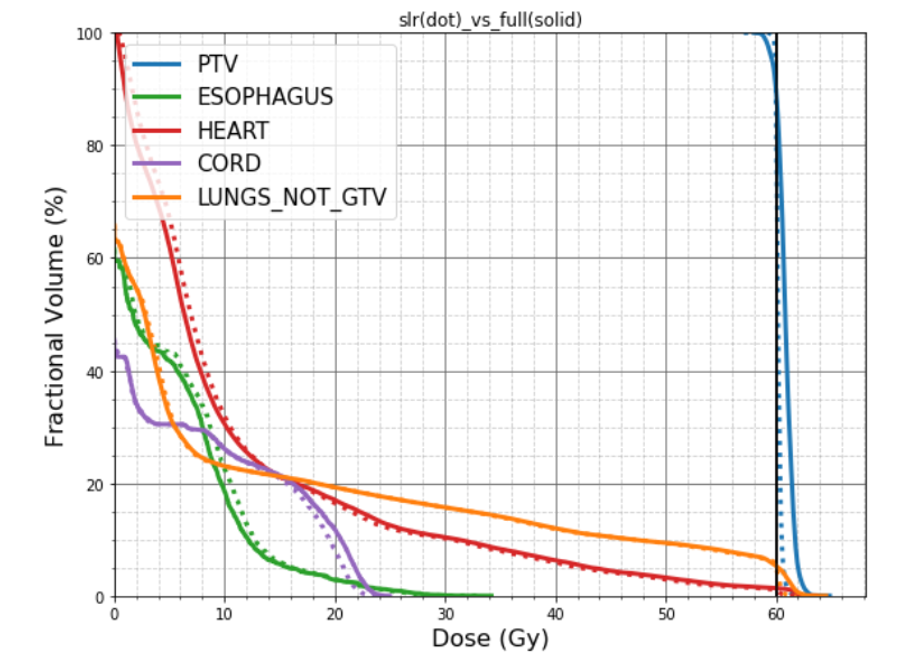

# Google Winter Of Code 2025 Projects for PortPy

Working on AI/ML involves working with a wide range of specialized tools—ranging from **data visualization** and **neural network model development** to **optimization algorithm** and **CI/CD package dissemination** (including website documentation and unit testing). The following project proposals provide hands-on experience in these critical areas.
## Index
### 1. Data Visualization (4 projects)
  1.1 [Interactive Plot for Dose-Volume Histograms (DVH) Data](#dvh)  
  1.2 [Animated Visualization of Multi-Leaf Collimator (MLC) Movements](#mlc)  
  1.3 [Interactive Image Slice Navigation of CT Scan and Radiation Dose Map](#dose)  
  1.4 [User-Friendly Web Dashboard for PortPy Dataset Visualization](#dashboard)    

### 2. Neural Network Model Development (3 projects)
  2.1 [Implementing the Top 3 Neural Network Models of the 2020-OpenKBP Challenge in PortPy](#openkbp)  

### 3. Optimization Algorithm (4 projects)
  3.1 [Using Google's Jax.Opt to Solve PortPy Optimization Problems](#JaxOpt)  
  3.2 [Using SciPy.Optimize to Solve PortPy Optimization Problems](#SciPy)  
  3.3 [Python Implementation of Gradient Descent Algorithm for Solving PortPy Optimization Problems](#PyGrad)  
  3.4 [Python Implementation of the ADMM Algorithm for  PortPy Optimization Problems](#PyADMM)    

### 4. CI/CD package dissemination (website documentation and unit testing) (2 projects)
  4.1 [Creating a Documentation Website with CI/CD Features for PortPy](#website)  
  4.2 [Creating Unit Tests with CI/CD Features for PortPy](#unittest)

 

---
## 1. Data Visualization
<h3 id="dvh"> 1.1 Interactive Plot for Dose-Volume Histograms (DVH) Data </h3>

**Requirements:** Matplotlib, Plotly (or alternative)  
**Good to Know:** PyQt (or alternative)  

**Short description:**

_What is DVH?_

A Dose-Volume Histogram (DVH) is a two-dimensional (2D) plot commonly used in radiotherapy to evaluate the radiation dose delivered to a patient’s body. Each organ under consideration is represented by a distinct line, as shown in the figure below. The x-axis indicates the radiation dose (measured in Gray), while the y-axis indicates the percentage of the organ’s volume receiving that dose.

Currently, PortPy relies on Matplotlib for DVH visualization, which offers limited interactivity. To enhance the user experience, we would like to create an interactive DVH visualization using Plotly. Additionally, integrating PyQt can provide a more flexible user interface—such as adding checkboxes to toggle the display of individual organs—making it easier to explore and interpret the data.

**Project Outcome:**  
- Interactive DVH line plots
- Ability to select structures through an interactive checkbox

---

 

<h3 id="MLC"> 1.2 Animated Visualization of Multi-Leaf Collimator (MLC) Movements </h3>

**Requirements:** Matplotlib, Plotly  
**Good to Know:** PyQt 

**Short description:**

_What is MLC?_

A Multi-Leaf Collimator (MLC) is a key component in radiotherapy machines, designed to shape the radiation beam to conform more precisely to the tumor’s geometry. It consists of multiple independently movable metal leaves that selectively block parts of the beam, thereby helping to target the tumor while sparing surrounding healthy tissue. The MLC is typically mounted at the top of the treatment machine (see below figure).

Current State: MLC movements are currently displayed as a series of static Matplotlib images. Our goal is to create an interactive, animated visualization using Plotly to show leaf movements in real-time  (e.g., something like [MLC_Movement](https://github.com/PortPy-Project/PortPy/blob/master/WOC/MLC_Movement.mp4))

**Project Outcome:**  
- Animated MLC movements 

 

---

<h3 id="dose"> 1.3 Interactive Image Slice Navigation of CT Scan and Radiation Dose Map </h3>

**Requirements:** Matplotlib, Plotly or PyVista
**Good to Know:** PyQt 

**Short description:**

_What is dose distribution map?_

A dose distribution map is a three-dimensional, color-coded image overlaid on a CT scan, illustrating how radiation is delivered throughout the patient’s body (see the figure below). By examining different slices of the CT scan, users can visualize the spatial variations of the radiation dose.

Currently, PortPy relies on Matplotlib for visualization, requiring users to manually input the slice number as a function argument. We would like to create a more interactive experience by incorporating Plotly or PyVista. With these tools, we can implement a slider bar that allows users to navigate through CT slices intuitively. In addition, integrating PyQt can further enhance the interface, providing more interactive and user-friendly controls.

**Project Outcome:**  
- View and explore dose maps interactively.
- Gain hands-on experience with medical imaging visualization.

 

---

<h3 id="dashboard"> 1.4 User-Friendly Web Dashboard for PortPy Dataset Visualization </h3>

**Requirements:** Matplotlib, Plotly (or alternative)  
**Good to Know:** Dash

**Short description:**

_What does PortPy Data consist of?_

PortPy includes a benchmark dataset of 50 lung patients and we keep expanding this dataset. Each patient’s data consists of metadata, stored as small JSON files, and actual data, stored as large HDF5 files. Only the metadata is needed for visualization and for displaying information such as the patient list, disease site, number of beams, and more.

Current Status: PortPy currently uses static Pandas DataFrames (see figure below) to display patient data, which limits interactivity and exploration. Our goal is to create an interactive, web-based dashboard using Plotly and Dash. This will enable users to more easily visualize and explore different aspects of the dataset.

**Project Outcome:**  
- Interactive Web-based dashboard to visualize PortPy dataset 
- Enable search, filter, and expand capabilities for metadata exploration.

 

---

## 3. Neural Network Model Development

<h3 id="openkbp"> 3.1 Implementing the Top 3 Neural Network Models of the 2020-OpenKBP Challenge in PortPy </h3>

**Requirements:** Proficiency in PyTorch, GPU-based training  
**Good to Know:** Keras, medical imaging concepts  

**Short description:**
In 2020, the American Association of Physicists in Medicine (AAPM) hosted a grand challenge named OpenKBP to develop neural network models capable of predicting delivered radiation dose from patient’s CT scan and organ masks. Such a model could significantly improve radiotherapy workflow. The top 3 models are available in the [OpenKBP-GitHub](https://github.com/ababier/open-kbp) repository.

Current Status: The PortPy.AI module currently implements a dose prediction pipeline using a basic U-Net model (see [Jupyter Notebook](https://github.com/PortPy-Project/PortPy/blob/master/examples/imrt_dose_prediction.ipynb)). We would like to integrate the top three network architectures from the 2020 challenge into the PortPy.AI module, and adapt them for training and testing with the PortPy benchmark dataset.

**Project Outcome:**  
- Train and implement a state-of-the-art dose prediction models. 
- Enhance workflows by radiotherapy dose prediction.

 

---

## 3. Optimization Algorithm
<h3 id="JaxOpt"> 3.1 Using Google's Jax.Opt to Solve PortPy Optimization Problems </h3>

**Requirements:** Proficiency in Python/NumPy, familiarity with optimization algorithms
**Good to Know:** Jax.Opt, SciPy  

**Short description:**
Radiotherapy involves finding an optimal set of radiation beam parameters for each patient. This process leads to large-scale optimization problems, typically formulated as Minimize f(x) subject to g(x) ≤ 0, which must be solved efficiently.

Current Status: PortPy currently uses the open-source library [CVXPy](https://www.cvxpy.org/) to solve these problems. We would like to investigate the potential benefits of employing Google’s Jax.Opt, which may offer improved speed and scalability especially on GPU. This involves trying different optimization algorithms offered by Jax.Opt (projected gradient descent, least-square, ADMM). 

**Project Outcome:**  
- Implement different algorithms from Jax.Opt and compare their performances against CVXPy

 

---

<h3 id="SciPy"> 3.2 Using SciPy.Optimize to Solve PortPy Optimization Problems </h3>

**Requirements:** Proficiency in Python, NumPy, SciPy
**Good to Know:** optimization algorithms  

**Short description:**

This project is similar to the previous one, however, instead of Jax.Opt, we would like to investigate the potential benefits of the optimization algorithms offered by SciPy.Optimize 

**Project Outcome:**  
- Implement different algorithms from SciPy.Optimize  and compare their performances against CVXPy
 

<h3 id="PyGrad"> 3.3 Python Implementation of Gradient Descent Algorithm for Solving PortPy Optimization Problems </h3>

**Requirements:** Proficiency in Python, Gradient Descent Algorithm, NumPy 
**Good to Know:** JAX

**Short description:**

This project is similar to the previous ones; however, instead of relying on existing packages like Jax.Opt or SciPy, we aim to directly implement the gradient descent algorithm in Python. Ideally, we will leverage Jax’s capabilities—such as automatic differentiation and JIT compilation—to accelerate computations, but we will not use Jax.Opt to solve the problem.

**Project Outcome:**  
- Implement gradient descent algorithm in Python and compare the performance against CVXPy

 

<h3 id="PyADMM"> 3.4 Python Implementation of the ADMM Algorithm for  PortPy Optimization Problems </h3>

**Requirements:** Proficiency in Python, ADMM 
**Good to Know:** JAX, CUDA, PyTorch, optimization techniques  

**Short description:**

This project is similar to the previous one; however, instead of using gradient descent, we will investigate the ADMM algorithm. Ideally, we will leverage Jax’s capabilities—such as automatic differentiation and JIT compilation—to accelerate computations, without relying on Jax.Opt to solve the problem

**Project Outcome:**  
- Implement ADMM algorithm in Python and compare the performance against CVXPy

 

## 4. CI/CD package dissemination (website documentation and unit testing) 
<h3 id="website"> 4.1 Creating a Documentation Website with CI/CD Features for PortPy </h3>

**Requirements:** Markdown 
**Good to Know:** reStructuredText, Sphinx, CI/CD

**Short description:**
Design and build a documentation website for PortPy using the Sphinx tool (see [YouTube-Sphinx-Crash-Course](https://www.youtube.com/watch?v=UourHBDZuR0) for a brief introduction). The website will resemble the [CVXPy-Website](https://www.cvxpy.org/) website but will feature different content (see the figures below for our initial website sketch). Ideally, we aim to incorporate modern CI/CD technology to enable easy and automated website updates in the future.

**Project Outcome:**  
- Create a visually appealing and user-friendly website.
- Gain hands-on experience with web development.

 

<h3 id="unittest"> 4.2 Creating Unit Tests with CI/CD Features for PortPy </h3>

**Requirements:** Python
**Good to Know:** PyTest, CI/CD

**Short description:**
Develop automated unit tests using the PyTest framework and few patients from the PortPy dataset. Additionally, integrate CI/CD technology to enable automatic testing for new releases, ensuring continuous quality and reliability of the PortPy project.

**Project Outcome:**  
- Implementation of unit tests integrated with CI/CD technology to ensure continuous quality checks for new releases.

 

---
