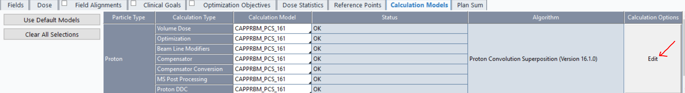
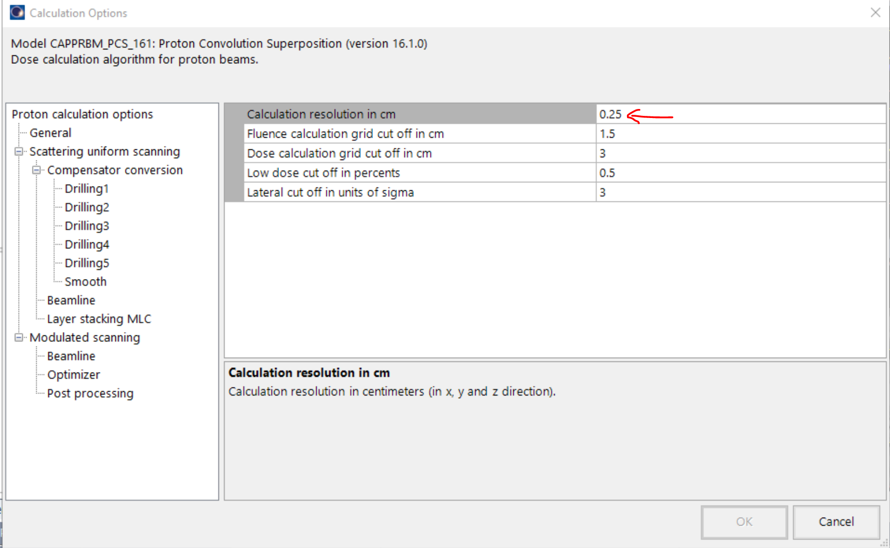

Steps to run proton dose calculation using Varian's ESAPI API and run optimization using PortPy proton module to create IMPT plan.

1. Clone Proton branch under PortPy repository.

```
git clone -b proton https://github.com/PortPy-Project/PortPy.git
```

2. Download proton dose calculation module using Eclipse ESAPI API from Varian's github [page](https://github.com/Varian-MedicalAffairsAppliedSolutions/MAAS-DoseInfluenceMatrix/tree/main)

3. Create a proton plan in eclipse and modify few parameters in Eclipse before running dose calculation.
- Modify calculation box volume in Eclipse. Default calculation box volume is set to whole CT. Users need to reduce calculation box volume to avoid computational issues for dose calc. Usually in z direction, calculation box can be reduced to PTV &pm; 3cm 
- Increase dose calculation resolution in Eclipse. default is 0.25cm. Users can make it to 0.4-0.5cm to avoid computational issues for dose calc.


- Change structure names in eclipse to the standard structure names used in Portpy optimization. e.g. 'PTVSmall' to 'PTV'. Users can avoid this step by manually mapping eclipse structure names to PortPy template structure names in PortPy example [proton_tutorial.py](https://github.com/PortPy-Project/PortPy/blob/Proton/examples/python_files/proton_tutorial.py).


4. Run eclipse dose calculation using the command below. It will create portpy data in the ./Results directory.
```
CalculateInfluenceMatrix.exe <patient mrn> <course name> <plan name>

```

5. Check out Portpy example [proton_tutorial.py](https://github.com/PortPy-Project/PortPy/blob/Proton/examples/python_files/proton_tutorial.py) to run IMPT optimization and create proton plan